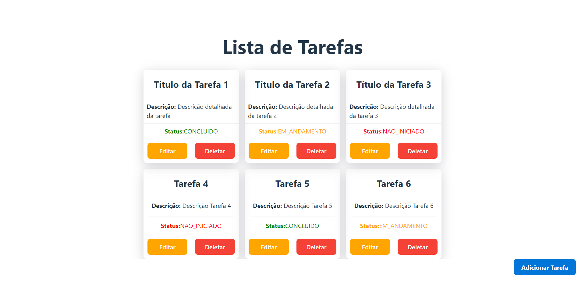
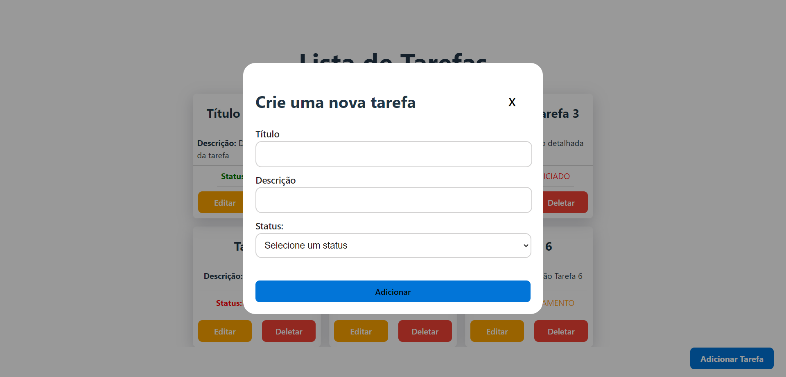
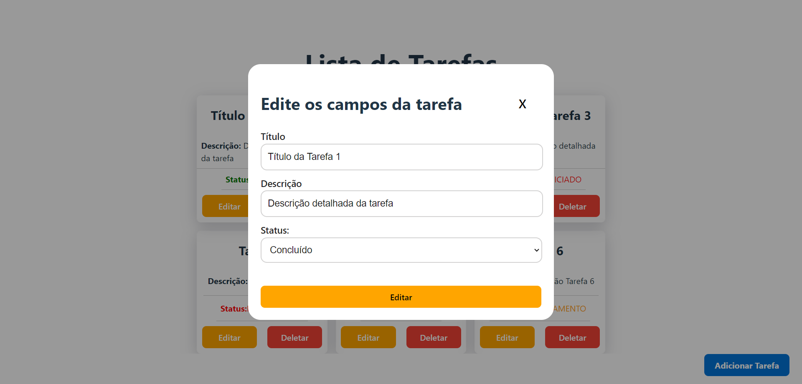

# Lista de Tarefas (To-Do List)


## Conteúdos

- [Requisitos](#requisitos)
- [Instalando Backend](#instalando-backend)
- [Instalando Frontend](#instalando-frontend)
- [Usabilidade](#usabilidade)
- [API Endpoints](#api-endpoints)
- [Banco de Dados](#banco-de-dados)

O *Backend* da aplicação foi desenvolvido utilizando **Java Spring e Spring MVC** para criação do servidor e conexão com banco de dados MySQL. 
O *Frontend* foi desenvolvido usando **React, TypeScript e React Query**.

<h1 align="center">
    
    
    
</h1>

## Requisitos

- Java instalado na sua máquina.
- Node.js e NPM instalados na sua máquina.

## Instalando Backend

1. Clone o repositório:

```bash
# Clone o repositório
$ git clone https://github.com/livmorais/to-do.git
```
```bash
# Acesse-o
$ cd backend
$ code .
```
2. Instalar todos as dependências com o Maven.

## Instalando Frontend

Depois de já ter clonado o projeto na sua máquina: 

```bash
cd frontend
$ code .
```
Para instalar as dependências, execute o seguinte comando:

```bash
npm install
```

Por fim, para executar o projeto basta rodar o seguinte:

```bash
npm run dev
```

## Usabilidade

1. Inicie o backend com o Maven.
2. A API estará disponível em: http://localhost:8080.

## API Endpoints
A API possui os seguintes endpoints:

- GET /tarefa: Retorna a lista de todas as tarefas.
- GET /tarefa/{id}: Retorna uma tarefa específica.
- POST /tarefa: Cria uma nova tarefa.
- PUT /tarefa/{id}: Edita uma tarefa específica.
- DELETE /tarefa/{id}: Deleta uma tarefa específica.
  

  *Exemplo do corpo da requisição POST*:
```json
{
  "titulo": "Título da Tarefa 2",
  "descricao": "Descrição detalhada da tarefa",
  "status": "EM_ANDAMENTO"
}
```


## Banco de Dados
O projeto utiliza o MySQL Database como o banco de dados.

